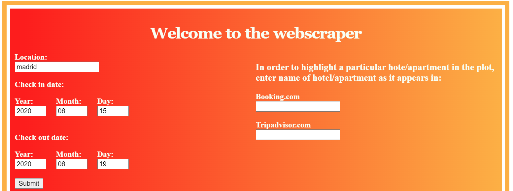
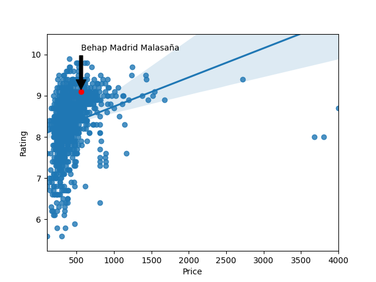

# HotelWebscraper

This script scrapes hotel names, prices and ratings from booking.com and Tripadvisor. The goal of the script is to aid hotel managers in better understanding how their price and rating compares to other hotels in the area.
There is a flask app that allows the user to interact with the code. The user specifies the town, check in, check out date and hotel name and the app generates a price to rating chart with that specific hotel highlighted.

#### Installation

1. Clone the repository
2. Run app.py
3. Open localhost:5000

#### Example usage

The home page of the flask app

The result after the data has been scraped

